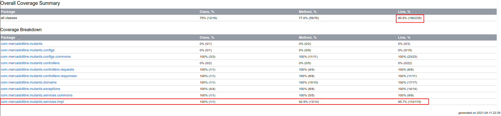

# Getting Started

The service was created using Java 11, Spring Boot 2.4.4 and PostgreSQL 11.
It was deployed in 5 initial instances in GCP and is prepared to auto-scale up to 10000 instances.

### Guide to run
* Install and configure a Postgresql database
* Change file `src/main/resources/application-develop.yml` using your DB configs.
* Execute `mvn clean package`
* To run this service, execute `mvn spring-boot:run -Dspring-boot.run.profiles=develop` or `java -jar target/mutants-0.0.1-SNAPSHOT.jar --spring.profiles.active=develop`
  
The service will be available on the default port 8080. Ex. `http://localhost:8080` with paths `POST /mutant/`, `GET /stats/` and `DELETE /stats/flush/` 

## GAE URL: https://mutants-310221.ue.r.appspot.com

#### Curl to check for the existence of mutant strands in dna
```shell
curl --location --request POST 'https://mutants-310221.ue.r.appspot.com/mutant/' \
--header 'Content-Type: application/json' \
--data-raw '{
    "dna": [
        "ATGCGA",
        "CAGCGC",
        "TTAATT",
        "AGTTGG",
        "GAGTTA",
        "TCACTT"
    ]
}'
```

#### Curl to get stats
```shell
curl --location --request GET 'https://mutants-310221.ue.r.appspot.com/stats/'
```

#### Curl to clean the base of DNA
```shell
curl --location --request DELETE 'https://mutants-310221.ue.r.appspot.com/stats/flush'
```


### Test coverage
The class of service that includes the DNA analysis logic contains over 95% test coverage and the entire project reaches over 80% coverage



